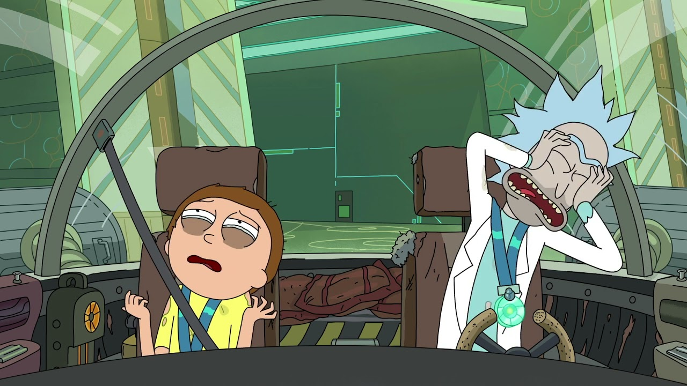

As a software engineer, I often work on big tasks that require hours of continuous and focused work. However, we have plenty of meetings, colleagues asking us something in Slack, and lunch breaks. Add a colleague who comes to you and calls you for a cup of coffee if you work from the office.

And usually, we don’t really have such a luxury as **hours** of uninterrupted time.

Nevertheless, sometimes we catch [**the flow**](https://www.amazon.com/Flow-Psychology-Experience-Perennial-Classics/dp/0061339202) of productive and focused work at the end of the workday. Imagine you come up with an elegant solution to a problem you’ve been tackling all day, or maybe even the whole past week. You can’t wait to implement and test your solution. And of course, you are so driven by your idea that you decide to continue working despite your working day being over. “20 minutes more and I will finish it,” you think. Obviously, this is not the case; some edge cases and new issues will inevitably arise. You come to your senses only 2–3 hours later—tired, hungry, demotivated, and still struggling with your problem. You just wasted your evening, with nothing to show for it. Worse, you overworked and didn’t recover that night. Thus, you were already exhausted when you started working.

You can imagine what will follow next. Nothing good, really.

I remember this happening back when I worked at a fast-growing startup, KazanExpress, while living in [Innopolis](https://en.wikipedia.org/wiki/Innopolis). Our office was buzzing with energy, and the pace was intense—we often pushed ourselves late into the night. One evening, I felt like I had finally cracked a tricky part of our infrastructure. I thought, “Just 20 more minutes and I’ll finish it.” Of course, those 20 minutes stretched into well over three hours. By the time I left the office, I was tired, hungry, and frustrated—without any real progress to show. The next morning, walking back to the office, I realized how drained I already felt before even starting work. That was when it became clear to me: it’s better to stop, write down the next steps, and come back with a fresh head.

Of course, some might argue, "But you are considering only a negative scenario; one could really finish that job in 20 minutes and go home happy...". Sure, but I think this risk is not worth it. Instead, I would suggest doing another thing.

Rather than trying to complete your task in 20 minutes, take this time to write down your thoughts, and a step-by-step action plan of what you think you need to do to finish your task. Then go home. Rest. A feeling of incompleteness will motivate you to come back and finalize your work the next day. Only you will be full of energy, together with a settled plan. No doubt you’ll accomplish your task before lunch.

Writing down the next steps helps to clear your mind after a  workday. You write and forget about your work until the next morning.

As a bonus, there is a chance that new, better ideas will come while you sleep or rest.

I have been using this trick for more than 5 years now, and it helps me to keep my work and life balanced.
Here are the two main ideas of it:

* Don’t overwork
* Write down the next steps before finishing your workday
